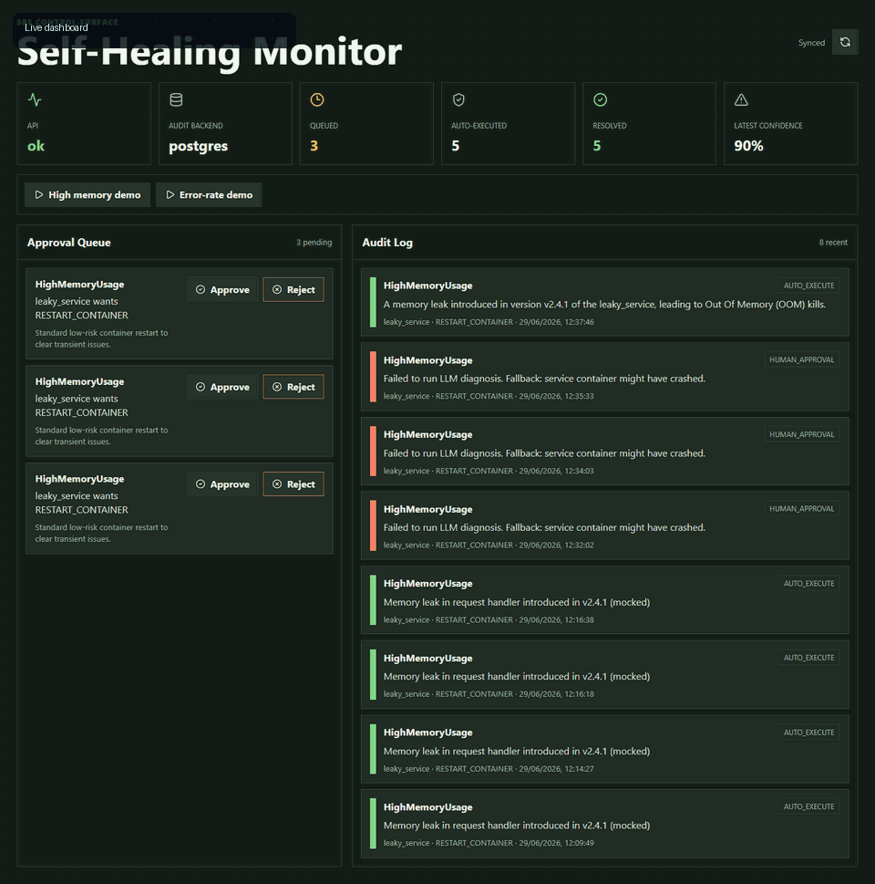
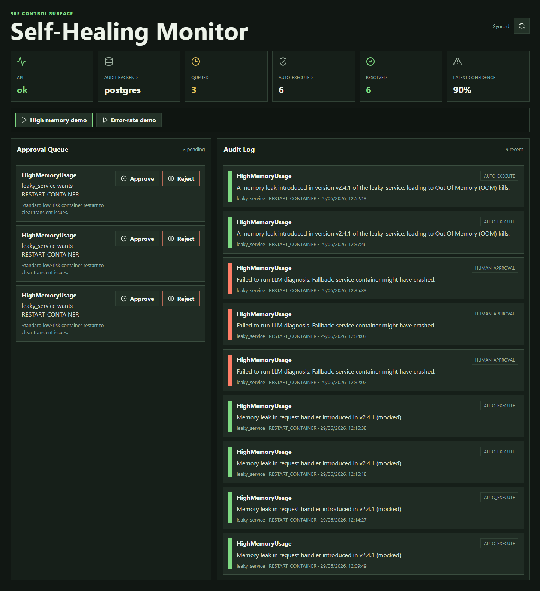
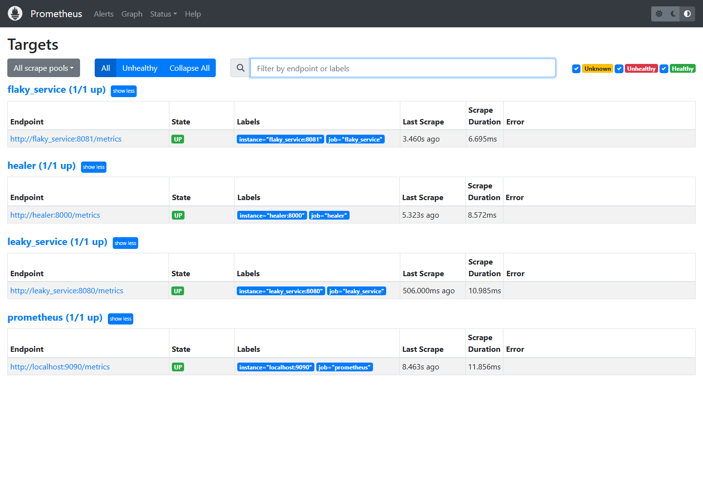
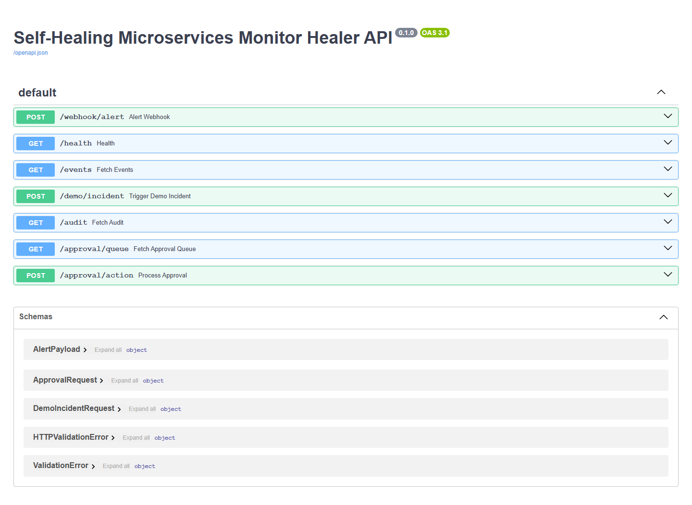
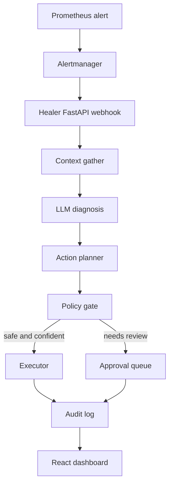

# Self-Healing Microservices Monitor

An AI-assisted SRE demo stack that receives Prometheus alerts, gathers service context, reasons over runbooks, and either auto-remediates low-risk incidents or queues the action for human approval.



[Watch the browser recording](demo_artifacts/self-healing-monitor-demo.webm)

## What The Demo Shows

- Prometheus and Alertmanager detect a faulty demo service.
- The healer API receives the alert and gathers metrics, logs, deploy context, and a matching runbook.
- The diagnosis node uses an LLM when `OPENROUTER_API_KEY` is configured, with deterministic fallback behavior for local testing.
- Runbook retrieval uses OpenAI embeddings when `OPENAI_API_KEY` is configured, and a local deterministic embedding fallback otherwise.
- The policy gate decides whether the safest action can be auto-executed or must go to the approval queue.
- Every incident is written to the audit log and displayed in the React dashboard.

## Screenshots

### Dashboard After A Live Incident



### Prometheus Targets



### Healer API Docs



More captures are available in [demo_artifacts/](demo_artifacts/).

## Architecture



## Key Components

| Area | Path | Purpose |
| --- | --- | --- |
| Healer API | `healer/src/main.py` | Alert webhook, health endpoint, audit APIs, approval APIs, demo incident trigger |
| Agent graph | `healer/src/agent/graph.py` | LangGraph workflow with one retry for failed auto-execution |
| Agent nodes | `healer/src/agent/nodes/` | Context gathering, diagnosis, action planning, and policy gating |
| Audit layer | `healer/src/audit/` | PostgreSQL and SQLite audit/approval persistence |
| Runbook RAG | `healer/src/rag/runbook_indexer.py` | Chroma-backed runbook retrieval with cloud/local embedding support |
| Demo services | `demo_services/` | Intentionally faulty services that expose Prometheus metrics |
| Infrastructure | `infra/` | Docker Compose, Prometheus, Alertmanager, Loki, Grafana, runbooks |
| Dashboard | `dashboard/` | React operator UI for incidents, audit records, and approvals |

## Quick Start

Prerequisites:

- Docker Engine
- Docker Compose
- Python 3.11+
- Node.js 20+ if running the dashboard outside Docker

Create your environment file:

```powershell
Copy-Item .env.example .env
```

Recommended environment values:

```env
OPENROUTER_API_KEY=your_openrouter_key
OPENROUTER_MODEL=google/gemini-2.5-flash
OPENAI_API_KEY=your_openai_key
AUDIT_BACKEND=postgres
```

Start the full stack:

```powershell
docker compose --env-file .env -f infra\docker-compose.yml up -d --build
```

Open the local services:

| Service | URL |
| --- | --- |
| Dashboard | http://localhost:3000 |
| Healer API | http://localhost:8000 |
| Healer API docs | http://localhost:8000/docs |
| Prometheus | http://localhost:9090 |
| Alertmanager | http://localhost:9093 |
| Grafana | http://localhost:3001 |

Trigger a demo incident:

```powershell
Invoke-RestMethod `
  -Method Post `
  -Uri http://localhost:8000/demo/incident `
  -ContentType application/json `
  -Body (@{ service = "leaky_service" } | ConvertTo-Json)
```

Or use the dashboard's demo incident controls.

## Local Development

Install backend dependencies:

```powershell
.\healer\.venv\Scripts\python.exe -m pip install -r healer\requirements.txt
```

Run unit tests:

```powershell
.\healer\.venv\Scripts\python.exe -m pytest healer\tests -q
```

Run evaluations:

```powershell
.\healer\.venv\Scripts\python.exe evals\run_evals.py
```

Build the dashboard:

```powershell
cd dashboard
npm install
npm run build
```

Capture demo artifacts:

```powershell
node scripts\capture_demo_artifacts.mjs
```

## Policy Model

The policy gate is intentionally conservative. It sends actions to the human approval queue when:

- Diagnosis confidence is below the configured threshold.
- The selected action is not in the auto-execution allowlist.
- Human approval is explicitly required by configuration.
- The action impact is high.
- The graph cannot find a safe low-risk remediation.

Low-risk actions such as restarting a known demo container may be auto-executed when confidence and policy checks pass. This keeps the project focused on AI-assisted operations with guardrails instead of unrestricted autonomous infrastructure changes.

See [docs/policy.md](docs/policy.md) for the detailed permission model.

## Verification Status

Latest local verification:

```text
Backend tests: 21 passed
Dashboard build: passed
Evaluation scenarios: 4/4 action correctness, 4/4 policy correctness
Docker stack: running
Healer health: ok
Audit backend: postgres
Runbook embeddings: openai
```

## Documentation

- [Architecture](docs/architecture.md)
- [Policy](docs/policy.md)
- [Evaluation](docs/evaluation.md)
- [Setup](docs/setup.md)
- [Deployment](docs/deployment.md)
- [Demo artifacts](demo_artifacts/README.md)

## Project Structure

```text
self-healing-monitor/
  dashboard/          React operator dashboard
  demo_artifacts/     Screenshots, GIF, and WebM recording for GitHub/demo use
  demo_services/      Faulty services used to trigger incidents
  docs/               Architecture, setup, deployment, evaluation, policy docs
  evals/              Scenario fixtures and evaluation runner
  healer/             FastAPI healer service, agent graph, tests
  infra/              Docker Compose, Prometheus, Alertmanager, Loki, Grafana, runbooks
  scripts/            Runbook indexing and demo artifact capture scripts
```

## Limitations

- The Kubernetes executor is scaffolded, but the working demo path uses Docker.
- Context gathering is intentionally lightweight for a local portfolio demo.
- Demo services are deliberately faulty and should not be treated as production service examples.
- Approval queue entries from old runs remain in the audit database until handled or the database is reset.

## License

MIT
