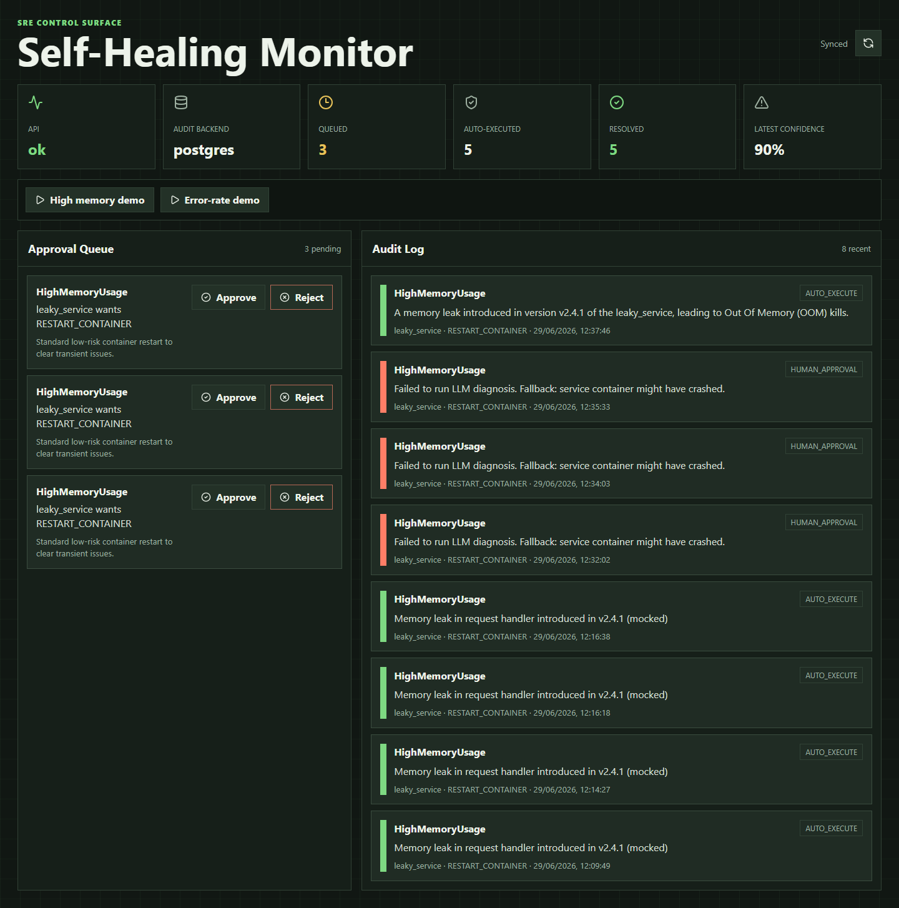
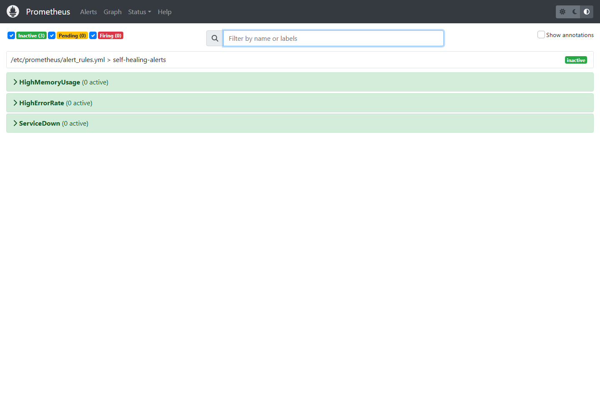
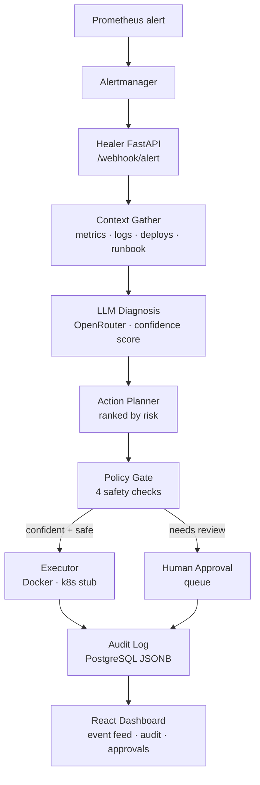

<div align="center">

# 🔁 Self-Healing Microservices Monitor

**An AI-powered SRE system that watches your services, diagnoses anomalies, and autonomously remediates low-risk incidents — with a full audit trail and a human-in-the-loop approval queue for everything else.**

[](https://www.python.org/)
[](https://fastapi.tiangolo.com/)
[](https://react.dev/)
[](https://www.langchain.com/langgraph)
[](https://www.postgresql.org/)
[](https://www.docker.com/)
[](LICENSE)

<br/>


[▶ Watch the full browser recording](demo_artifacts/self-healing-monitor-demo.webm)

</div>

---

## Why I Built This

I wanted to explore a concrete question that matters in production systems: *how much trust should you give an AI agent operating on live infrastructure?*

Not as a theoretical exercise — by actually building the system and making the design decisions real. The interesting parts aren't the LLM calls. They're the **policy gate** (what the agent is and isn't allowed to do autonomously), the **audit log** (full LLM reasoning captured, not just the action taken), and the **human-in-the-loop queue** (a deliberate escape valve for anything above a confidence or risk threshold).

This project is an exploration of **agentic AI safety applied to a real SRE problem**.

---

## Screenshots

| Dashboard overview | Approval queue & audit log |
|---|---|
|  |  |

| After a live incident | Prometheus targets |
|---|---|
|  |  |

| Prometheus alert rules | Healer API docs |
|---|---|
|  |  |

---

## What It Does

1. **Receives** anomaly alerts from Prometheus Alertmanager via webhook
2. **Gathers context** — metrics window, log lines, recent deploys, and a semantically matched runbook (RAG over markdown runbooks via ChromaDB + OpenAI embeddings)
3. **Diagnoses** the probable root cause using an LLM reasoning loop (OpenRouter) with a confidence score
4. **Plans** remediation steps ranked by risk: `RESTART_CONTAINER → SCALE_REPLICAS → ROLLBACK_DEPLOY → NOTIFY_ONLY`
5. **Routes** through a policy gate: auto-executes low-risk, high-confidence actions; queues everything else for human review
6. **Logs** every decision — action taken, full LLM reasoning, and outcome — to a structured PostgreSQL audit log
7. **Displays** a live event feed, audit log, and approval queue in a React dashboard

---

## Architecture



### The Policy Gate — Four Conditions for Autonomous Execution

All four must pass for auto-execution. Any single failure routes to the human approval queue.

| # | Check | Condition | Pass → | Fail → |
|---|-------|-----------|--------|--------|
| 1 | **Confidence threshold** | score ≥ 0.75 | Continue | Human queue |
| 2 | **Action allowlist** | action in `ALLOWED_AUTO_ACTIONS` | Continue | Human queue |
| 3 | **Impact level** | impact ≠ `high` | Continue | Human queue |
| 4 | **Override flag** | `REQUIRE_HUMAN_APPROVAL=false` | Auto-execute | Human queue |

Default allowlist: `RESTART_CONTAINER`, `NOTIFY_ONLY`. `SCALE_REPLICAS` and `ROLLBACK_DEPLOY` require human approval by default.

> The allowlist is an environment variable — operators can expand autonomy incrementally as trust grows. See [`docs/policy.md`](docs/policy.md).

---

## Key Components

| Area | Path | Purpose |
|------|------|---------|
| **Healer API** | `healer/src/main.py` | Alert webhook, health endpoint, audit APIs, approval APIs, demo incident trigger |
| **Agent graph** | `healer/src/agent/graph.py` | LangGraph workflow with one retry for failed auto-execution |
| **Agent nodes** | `healer/src/agent/nodes/` | Context gathering, LLM diagnosis, action planning, policy gating |
| **Audit layer** | `healer/src/audit/` | PostgreSQL audit log and approval queue persistence |
| **Runbook RAG** | `healer/src/rag/runbook_indexer.py` | ChromaDB runbook retrieval with OpenAI `text-embedding-3-small` |
| **Demo services** | `demo_services/` | Intentionally faulty services for triggering realistic incidents |
| **Infrastructure** | `infra/` | Docker Compose, Prometheus, Alertmanager, Loki, Grafana, runbooks |
| **Dashboard** | `dashboard/` | React operator UI for incidents, audit records, and approvals |

---

## Quick Start

**Prerequisites:** Docker Engine, Docker Compose, Python 3.11+, Node.js 20+

### 1. Configure

```bash
cp .env.example .env
```

Edit `.env` with your keys:

```env
OPENROUTER_API_KEY=your_openrouter_key   # LLM provider (OpenRouter free tier works)
OPENROUTER_MODEL=google/gemini-2.5-flash
OPENAI_API_KEY=your_openai_key           # For text-embedding-3-small runbook RAG
AUDIT_BACKEND=postgres
REQUIRE_HUMAN_APPROVAL=false             # Set true to force all actions to queue
```

> **No API keys?** The system degrades gracefully — deterministic fallback diagnosis and local embedding stubs let you run the full pipeline locally without any API calls.

### 2. Start the stack

```bash
docker compose --env-file .env -f infra/docker-compose.yml up -d --build
```

### 3. Open the services

| Service | URL |
|---------|-----|
| **Dashboard** | http://localhost:3000 |
| **Healer API** | http://localhost:8000 |
| **API Docs** | http://localhost:8000/docs |
| **Prometheus** | http://localhost:9090 |
| **Alertmanager** | http://localhost:9093 |
| **Grafana** | http://localhost:3001 |

### 4. Trigger a demo incident

```bash
curl -s -X POST http://localhost:8000/demo/incident \
  -H "Content-Type: application/json" \
  -d '{"service": "leaky_service"}'
```

Or use the **Demo Incident** button in the dashboard. Watch the healer detect, diagnose, and remediate in real time.

---

## Audit Log Schema

Every incident produces a complete audit record regardless of outcome. The record captures the full LLM reasoning, not just the action taken — so post-mortems have the complete picture.

```json
{
  "incident_id": "uuid",
  "alert": { "name": "HighMemoryUsage", "service": "leaky_service", "severity": "warning" },
  "context": {
    "metrics_summary": "memory_usage peaked at 94% at 14:32:01",
    "log_summary": "repeated OOMKilled events in last 10 minutes",
    "runbook_matched": "high_memory.md"
  },
  "diagnosis": {
    "root_cause": "Memory leak in request handler introduced in v2.4.1",
    "confidence": 0.82,
    "supporting_evidence": ["94% memory at spike", "OOMKilled in logs", "deploy 47min ago"]
  },
  "policy_gate": {
    "decision": "auto_execute",
    "checks": {
      "confidence_threshold": { "passed": true, "value": 0.82, "threshold": 0.75 },
      "allowlist": { "passed": true, "action": "RESTART_CONTAINER" },
      "impact_level": { "passed": true, "level": "low" },
      "override_flag": { "passed": true, "require_human": false }
    }
  },
  "execution": { "status": "success", "output": "Container restarted", "alert_resolved": true },
  "total_duration_seconds": 9.7
}
```

Records are stored in PostgreSQL with a `JSONB` column for the full document plus indexed scalar columns (`service`, `decision`, `received_at`) for fast dashboard queries.

---

## Verification Status

```
Backend tests:        21 passed
Dashboard build:      passed
Evaluation scenarios: 4/4 action correctness, 4/4 policy correctness
Docker stack:         running
Healer health:        ok
Audit backend:        postgres
Runbook embeddings:   openai
```

---

## Testing

```bash
# Unit tests — policy gate, action planner, context gather (no LLM calls)
.venv/Scripts/python -m pytest healer/tests/unit -q

# Integration + scenario tests
.venv/Scripts/python -m pytest healer/tests -q

# Run the evaluation suite
.venv/Scripts/python evals/run_evals.py
```

**Test strategy:**

| Layer | What's covered |
|-------|---------------|
| `tests/unit/test_policy_gate.py` | All four policy checks, edge cases, override flag |
| `tests/unit/test_action_planner.py` | Risk ordering, action enum validation |
| `tests/unit/test_context_gather.py` | Prometheus/Loki mocks, degraded context handling |
| `tests/integration/` | Full webhook → LangGraph → executor flow with mocked LLM |
| `tests/scenarios/` | Named incident fixtures replayed against the full stack |

---

## Local Development

```bash
# Install backend dependencies
pip install -r healer/requirements.txt

# Run the healer API locally (needs Postgres + Prometheus + Loki running)
uvicorn healer.src.main:app --reload

# Build the dashboard
cd dashboard && npm install && npm run dev

# Re-index runbooks after edits
python scripts/index_runbooks.py
```

---

## Project Structure

```
self-healing-monitor/
├── dashboard/          React operator UI (event feed, audit log, approvals)
├── demo_artifacts/     Screenshots and GIF/WebM recording
├── demo_services/
│   ├── leaky_service/  Gradually consumes memory until OOM
│   └── flaky_service/  Returns random HTTP 500s at a configurable rate
├── docs/
│   ├── architecture.md
│   ├── policy.md       Agent permission model (first-class document)
│   ├── evaluation.md
│   ├── setup.md
│   ├── deployment.md
│   └── adr/            Architecture Decision Records
│       ├── 001-human-in-the-loop-policy.md
│       ├── 002-langgraph-state-machine.md
│       ├── 003-audit-log-schema.md
│       └── 004-chromadb-runbook-rag.md
├── evals/
│   ├── scenarios.jsonl  Labelled incident scenarios
│   └── run_evals.py
├── healer/
│   ├── src/
│   │   ├── agent/
│   │   │   ├── graph.py            LangGraph state machine
│   │   │   └── nodes/
│   │   │       ├── context_gather.py
│   │   │       ├── diagnose.py
│   │   │       ├── action_planner.py
│   │   │       └── policy_gate.py  ← the most important file
│   │   ├── audit/
│   │   │   ├── db.py
│   │   │   └── logger.py
│   │   ├── executor/
│   │   │   ├── docker_executor.py
│   │   │   └── k8s_executor.py
│   │   ├── rag/
│   │   │   └── runbook_indexer.py
│   │   ├── config.py
│   │   └── main.py
│   └── tests/
├── infra/
│   ├── docker-compose.yml
│   ├── prometheus/      Config, alert rules, Alertmanager
│   ├── loki/
│   ├── grafana/
│   └── runbooks/        Markdown runbooks for RAG retrieval
└── scripts/
```

---

## Limitations & Future Work

**Current limitations:**
- Kubernetes executor is scaffolded but the working demo path uses Docker
- Context gathering is intentionally lightweight — heuristic log filtering and a fixed metrics window
- No feedback loop — the agent doesn't improve from past incident outcomes
- Action set is intentionally small (restart, scale, rollback, notify) — anything more complex requires human intervention by design

**Planned:**
- [ ] Outcome feedback loop — track whether auto-executed actions resolved the alert; feed results back as few-shots for future diagnoses
- [ ] Kubernetes executor (full implementation)
- [ ] Multi-service incident correlation — detect cascading failures
- [ ] Runbook auto-generation — draft a new runbook for incident types the agent hasn't seen before

---

## Documentation

- [Architecture](docs/architecture.md)
- [Policy model](docs/policy.md)
- [Evaluation methodology](docs/evaluation.md)
- [Setup guide](docs/setup.md)
- [Deployment guide](docs/deployment.md)
- [Demo artifacts](demo_artifacts/README.md)
- [ADR-001 Human-in-the-loop policy](docs/adr/001-human-in-the-loop-policy.md)
- [ADR-002 LangGraph state machine](docs/adr/002-langgraph-state-machine.md)
- [ADR-003 Audit log schema](docs/adr/003-audit-log-schema.md)
- [ADR-004 ChromaDB runbook RAG](docs/adr/004-chromadb-runbook-rag.md)

---

## License

MIT
