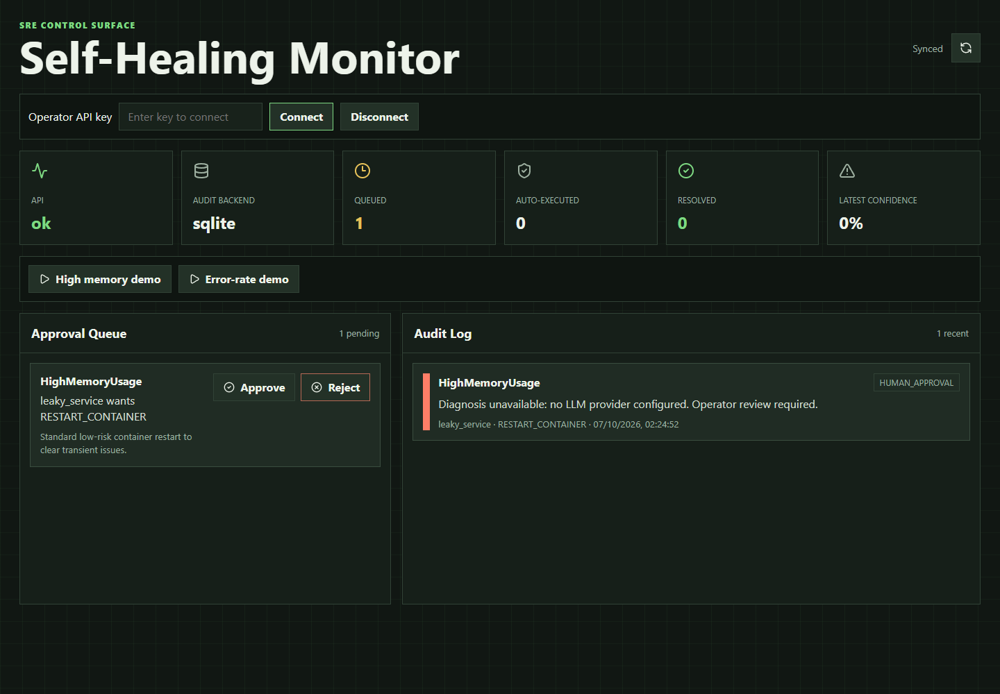
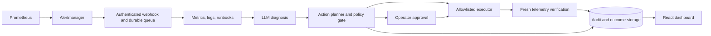

# Self-Healing Microservices Monitor

[](https://github.com/Protagonist01/self-healing-monitor/actions/workflows/ci.yml)
[](LICENSE)

An AI-assisted incident response system that turns Prometheus alerts into explainable
remediation proposals. Operators review an action in a React dashboard; the healer
restarts an allowlisted Docker container, checks fresh telemetry, and records the result.

**Portfolio project · pre-production · single Docker host.** No public deployment is
currently available. [Deployment guide](docs/deployment.md) · [Audit findings](docs/assessment.md)

## See the project



This October 2026 view shows a synthetic alert on the real local API using SQLite,
with no LLM provider configured: zero confidence and operator review. No repair was
executed for this capture.

The original [demo recording](demo_artifacts/self-healing-monitor-demo.webm) and
[screenshots](demo_artifacts/README.md) show the interface. These historical captures
include mocked diagnoses and predate current authentication and recovery checks.
Use the walkthrough below to evaluate the current implementation.

## Engineering highlights

- **A bounded agent workflow:** LangGraph separates context gathering, diagnosis,
  planning, policy checks, execution, verification, and audit persistence.
- **Recommendations need permission:** human approval is on by default; exact container
  names and an explicit allowlist restrict Docker restarts. Only low-impact allowlisted
  actions can run autonomously when an operator enables that mode.
- **Recovery needs evidence:** command success is separate from repair success.
  A healthy metric and a successful scrape after execution are required.
- **Durable intake and concurrency controls:** PostgreSQL stores work and approvals.
  Intake suppresses duplicates; an atomic approval claim prevents two operators executing
  the same proposal. Interrupted work is held for review.
- **Honest failures:** missing provider keys, logs, metrics, or Docker access remain
  visible failures. Invalid AI responses cannot produce a confident diagnosis.
- **Reproducible checks:** pinned dependencies, regression tests, deterministic policy
  evaluations, linting, and container checks in CI.

## How it works


```mermaid
flowchart LR
    P[Prometheus] --> A[Alertmanager]
    A --> Q[Authenticated webhook and durable queue]
    Q --> C[Metrics, logs, runbooks]
    C --> D[LLM diagnosis]
    D --> G[Action planner and policy gate]
    G --> H[Operator approval]
    G --> E[Allowlisted executor]
    H --> E
    E --> V[Fresh telemetry verification]
    V --> DB[(Audit and outcome storage)]
    G --> DB
    DB --> UI[React dashboard]
```

| Layer | Stack |
| --- | --- |
| Operator interface | React, TypeScript, Vite |
| API and workflow | Python, FastAPI, LangGraph |
| Diagnosis and retrieval | OpenRouter, Markdown runbooks, embedded ChromaDB; optional OpenAI embeddings |
| Persistence | PostgreSQL; SQLite for local development and tests |
| Telemetry | Prometheus, Alertmanager, Grafana, Loki |
| Packaging | Docker Compose, GitHub Actions, Dependabot |

See the [architecture](docs/architecture.md), [design decisions](docs/adr/), and
[build book](BUILD_BOOK.md) for implementation details and tradeoffs.

## Run locally

Requires Docker Engine with Compose and Python 3.11+ for credential generation.
Start Docker Desktop on Windows. Run from the repository root:

```sh
git clone https://github.com/Protagonist01/self-healing-monitor.git
cd self-healing-monitor
cp .env.example .env
python scripts/init_secrets.py
docker compose --env-file .env -f infra/docker-compose.yml up -d --build
```

In PowerShell, `Copy-Item .env.example .env` also works. The credentials script
preserves existing secrets and never prints them.

| Service | Local address |
| --- | --- |
| Operator dashboard | [localhost:3000](http://localhost:3000) |
| API documentation | [localhost:8000/docs](http://localhost:8000/docs) |
| Prometheus | [localhost:9090](http://localhost:9090) |
| Grafana | [localhost:3001](http://localhost:3001) |

Enter the key in `.secrets/healer_api_key` in the dashboard connection form. It stays
in memory until disconnect or page close. Grafana uses `admin` and the password in
`.secrets/grafana_password`; its data sources and dashboard are provisioned automatically.
Keep `.secrets/` private and out of Git.

Set `OPENROUTER_API_KEY` in `.env` for live AI diagnosis. `OPENAI_API_KEY` is optional
for semantic runbook embeddings; without it, retrieval uses local hash embeddings.
Without a diagnosis key, incidents reach operator review with zero confidence.
Provider keys may incur charges and send supplied context to that provider.

All ports bind to localhost. Remote access uses an SSH tunnel or a private network
with TLS. See [setup](docs/setup.md) for configuration and troubleshooting.

## Try an incident

1. Start the stack and connect the dashboard.
2. Call `http://localhost:8080/leak` twelve times using a browser or HTTP client.
   Each request allocates 5 MiB in the disposable demo service. Its gauge measures
   these allocated blocks, not actual host memory.
3. Watch [Prometheus alerts](http://localhost:9090/alerts). After the scrape, alert,
   and grouping intervals, Alertmanager sends `HighMemoryUsage` to the healer.
4. Review the proposed restart and context in the dashboard. Approve it only for
   the demo container. Approval performs a real Docker restart.
5. Check the audit result: restart success alone is insufficient. Fresh healthy
   telemetry must confirm recovery. Missing evidence leaves it unverified.

`python scripts/smoke_deployment.py` checks connectivity, authentication, Grafana
provisioning, and scrape targets without modifying services. The opt-in
`--exercise-restart` mode performs the disposable memory incident above.

Synthetic dashboard buttons require `ENVIRONMENT=development` and
`ENABLE_DEMO_ENDPOINT=true`, then recreating the healer. They submit an alert; they
do not create a real fault. Keep both disabled on a private production-like host.

## Develop and verify

Requires Python 3.11+ and Node.js 22.12+.

```sh
python -m venv .venv
# Activate: source .venv/bin/activate (POSIX) or .venv\Scripts\Activate.ps1 (PowerShell)
python -m pip install -r healer/requirements.txt
python -m pip install ruff pip-audit
python -m ruff check healer demo_services evals scripts
python -m ruff format --check healer demo_services evals scripts
python -m pytest healer/tests -q
python evals/run_evals.py
python scripts/audit_dependencies.py
npm --prefix dashboard ci
npm --prefix dashboard run format:check
npm --prefix dashboard run build
npm --prefix dashboard audit --audit-level=moderate
```

Tests isolate databases and mock external infrastructure. Policy fixtures check action
selection and approval routing; they do **not** measure live diagnosis quality. See
[evaluation](docs/evaluation.md) and the dated [assessment](docs/assessment.md).

## Scope and known limits

- Supported remediation is an exact-name Docker restart. Docker scaling and rollback
  return unsupported results. The Kubernetes module is experimental and disconnected.
- One healer process owns the queue. A crash between a command and its audit write
  leaves an uncertain outcome; exactly-once execution is not claimed.
- Loki is configured, but no log collector is included. Deployment history has no
  provider. Missing information is reported without invented evidence.
- Recovery thresholds cover the supplied alert rules. New alerts need their own logic
  and tests. Operators share one API key; per-user roles are future work.
- ChromaDB server mode is disabled. Four upstream server advisories have narrow,
  expiring [dependency exceptions](docs/dependency-security.md); the package is not
  described as vulnerability-free.
- Docker socket access gives the healer powerful host control. Public hosting and
  production acceptance require the work in the [deployment guide](docs/deployment.md).

## Repository guide

| Path | Contents |
| --- | --- |
| `healer/` | API, agent nodes, executors, persistence, tests |
| `dashboard/` | Operator UI and non-root static container |
| `infra/` | Compose stack, alert rules, Grafana provisioning, runbooks |
| `demo_services/` | Intentionally faulty disposable services |
| `evals/` | Fixed action and policy fixtures |
| `scripts/` | Credentials, dependency review, deployment smoke checks |
| `docs/` | Setup, deployment, architecture, policy, assessment |

[Contributing](CONTRIBUTING.md) · [Security reporting](SECURITY.md) · [MIT license](LICENSE)
