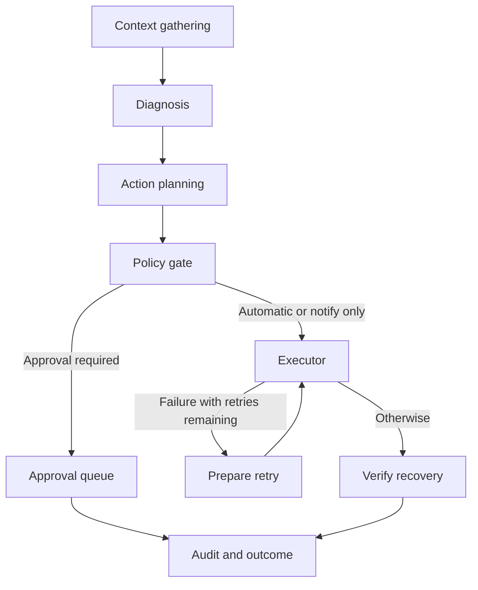

# ADR-002: LangGraph state machine

## Status

Accepted.

## Context and decision

The workflow has sequential context, diagnosis, and planning steps, followed by a
policy branch. LangGraph keeps that branch and the retry limit explicit. Each node
accepts and returns `HealerState`; nodes mutate state and may perform network or
database operations. Tests mock those effects.

Human approval is an API path: atomically claim the saved snapshot, execute once,
verify recovery, and audit the final result. The original policy decision is retained.
Failed automatic execution retries up to `MAX_AUTO_EXECUTION_RETRIES`, then proceeds
to verification and audit. Exhausted failures are not automatically put into another
approval queue.

## Tradeoffs and operational boundaries

A plain Python function would have fewer framework concepts; the graph makes this
project's branching workflow easier to inspect and extend. LangGraph adds dependencies
and a learning cost for contributors. No measured graph-overhead estimate is claimed.

The graph is compiled without a LangGraph checkpointer. SQL queue and approval tables
store incident snapshots, not every graph transition. A worker crash quarantines
interrupted work for review instead of blindly replaying commands. Executor duration
and total audit duration are recorded; per-node timing metrics are not implemented.
Missing telemetry is handled inside fetch helpers and reported in state.
