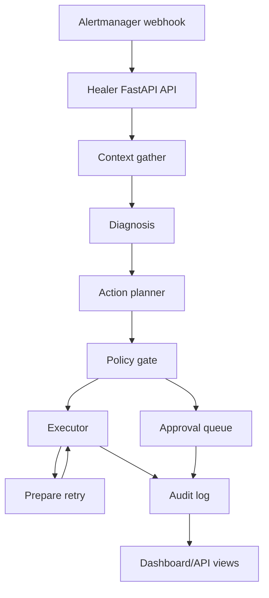

# Architecture

The project is a local SRE demo stack for receiving Prometheus Alertmanager webhooks, gathering incident context, selecting a low-risk remediation path, and preserving an audit trail.

## Runtime Flow



## Components

- `healer/src/main.py` exposes webhook, audit, approval, health, and demo endpoints.
- `healer/src/agent/graph.py` defines the LangGraph state machine and one retry for failed auto-execution.
- `healer/src/agent/nodes/` contains context gathering, diagnosis, action planning, and policy gating.
- `healer/src/audit/` writes audit and approval records to PostgreSQL or SQLite.
- `healer/src/rag/runbook_indexer.py` indexes markdown runbooks with ChromaDB. It uses OpenAI embeddings when `OPENAI_API_KEY` is present and local deterministic hash embeddings otherwise.
- `demo_services/` contains intentionally faulty FastAPI services that expose Prometheus metrics.
- `infra/` contains Docker Compose, Prometheus, Alertmanager, Loki, runbooks, and Grafana dashboard configuration.
- `dashboard/` contains the React operator UI.

## Local Demo Modes

The default Docker Compose mode uses PostgreSQL. For a lighter local API-only run, set:

```env
AUDIT_BACKEND=sqlite
SQLITE_PATH=./healer_audit.db
```

Without `OPENROUTER_API_KEY`, diagnosis uses a deterministic mock. Without `OPENAI_API_KEY`, runbook retrieval uses local hash embeddings.
